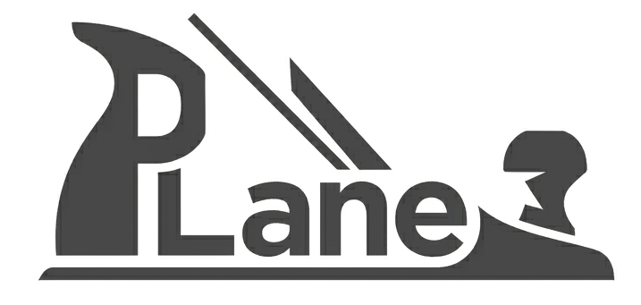

# plane

[]()

<p align="center">
  
</p>

## Install

Requires Python 3.12+.

```bash
uv add plane-hdl
```

## Quick Start

```python
from plane import *

class Blink(Module):
    def elaborate(self):
        self.clk = IO(Input(Clock()), name="clk")
        self.rst = IO(Input(AsyncLowReset()), name="rst")
        self.led = IO(Output(Bool()), name="led")
        self.counter = Reg(UInt(24), init=0, name="counter")
        self.counter @= self.counter + Literal(1, 24)
        self.led @= self.counter[23]
```

```python
print(emitVerilog(Blink()))
```

```verilog
module Blink (
  input  logic clk,
  input  logic rst,
  output logic led
);

  logic [23:0] counter;

  assign led = counter[23];

  always_ff @(posedge clk or negedge rst) begin
    if (!rst) begin
      counter <= 24'd0;
    end else begin
      counter <= (counter + 24'd1);
    end
  end

endmodule
```

See `docs/` for the full guide.

## Motivation

A PythonHDL inspired by Chisel

Chisel is a powerful HDL based on Scala. While powerful, it being based on Scala has some downsides with regards to
interopting with various other flows in a semiconductor design cycle. For better or for worse, Python has become the dominant language
for scripting various flows (and now AI pipelines) and therefore it seemed prudent to have a way to build SystemVerilog 
utilizing a Python based HDL. There are other Python HDLs out there [Amaranth](https://github.com/amaranth-lang/amaranth), 
Migen, MyHDL, etc. This library was not created to supersede those, but meerly to coexist and offer another solution.

The name "Plane" is meant as a play on word in a few ways:

1. Plane to sound similar to "plain", indicating this is a slightly simple library
2. Plane as in a [plane](https://en.wikipedia.org/wiki/Plane_(tool)) woodworking tool, paying a homage to Chisel. Where a Chisel
   would require precise, fine tune actions, a plane just uses brute forcce to get something done.

Many of Chisel's concepts have been used here in Plane. Certain structures are modified as necessary for the differences in Python and Scala.
Plane is not as feature rich as the Chisel ecosystem, and the long term plan is for it not to be.

## Features

- **Data types**: `UInt`, `SInt`, `Bool`, `Clock`, `Reset`, `PlaneEnum`, `Vec`
- **Modules, ports, `Bundle` structured interfaces**
- **Combinational** (`AlwaysComb`) and **sequential** (`Reg`, `RegNext`) logic
- **Control flow**: `When`/`ElseWhen`/`Otherwise`, `Switch`/`Case`/`Default`
- **Parameters and blackboxes**
- **Comments** in emitted Verilog
- **CSR subsystem**: `RegisterBlock`/`RegisterSystem`, field types, APB adapters
- **Collateral generation**: YAML, UVM RAL, HTML

## SystemVerilog Emission

Most issues with meta-language HDLs is the undoubtly the emitted RTL that is produced. FSMs in particular are quite difficult
to look at for Chisel-generated RTL. Plane's design was really built with verilog emission being a core principle. Most of the
lifecycle for some RTL is spent being _read_ versus _modified_. For this reason, we want the RTL that is produced to be
as close to human-readable as possible. There are times this is difficult depending on your usecases, however many of the 
features and/or language decisions were chosen to aid in emission quality. If anything, this was the main motivation for Plane.
This means the Plane HDL looks similar to SV in nature. This was a design decision to make it clear what you were designing
and to ease the transition for regular RTL designers.

## FSM Showcase

A simple 3-state FSM that advances to the next state when `advance` is high, otherwise holds. This shows `AlwaysComb`, `Switch`/`Case`, and `When` working together:

```python
from plane import *

class State(PlaneEnum):
    A = 0
    B = 1
    C = 2

class SimpleFSM(Module):
    def elaborate(self):
        self.clk = IO(Input(Clock()), name="clk")
        self.rst = IO(Input(AsyncLowReset()), name="rst")
        self.advance = IO(Input(Bool()), name="advance")
        self.state = IO(Output(State), name="state")

        self.state_reg = Reg(State, init=State.A, name="state_reg", optimize=False)
        self.state_next = Wire(State, name="state_next")

        with AlwaysComb():
            self.state_next @= self.state_reg  # default: hold
            with Switch(self.state_reg):
                with Case(State.A):
                    with When(self.advance):
                        self.state_next @= State.B
                with Case(State.B):
                    with When(self.advance):
                        self.state_next @= State.C
                with Case(State.C):
                    with When(self.advance):
                        self.state_next @= State.A

        self.state_reg @= self.state_next
        self.state @= self.state_reg
```

Emitted Verilog:

```verilog
package SimpleFSM_pkg;
  typedef enum logic [1:0] { A, B, C } State_t;
endpackage

module SimpleFSM (
  input  logic       clk,
  input  logic       rst,
  input  logic       advance,
  output logic [1:0] state
);

  import SimpleFSM_pkg::*;

  State_t state_next;
  State_t state_reg;

  assign state = state_reg;

  always_comb begin
    state_next = state_reg;
    case (state_reg)
      State_t::A: begin
        if (advance) begin
          state_next = State_t::B;
        end
      end
      State_t::B: begin
        if (advance) begin
          state_next = State_t::C;
        end
      end
      State_t::C: begin
        if (advance) begin
          state_next = State_t::A;
        end
      end
    endcase
  end

  always_ff @(posedge clk or negedge rst) begin
    if (!rst) begin
      state_reg <= State_t::A;
    end else begin
      state_reg <= state_next;
    end
  end

endmodule
```

## AI Usage

The base level library was coded using locally hosted models (Qwen3.5-27b-Q4_K_M and Qwen3.6-27b-Q4_K_M (with and without MTP)). 
These were run on a server with a i7-6950X, 64GB 2400MHz DDR4, and using an AMD R9700 PRO 32GB. This setup allowed roughly 200k of
context and OpenCode was used as the coding harness.

As much as this was an exercise in creating an HDL library for simple usecases, it also was an exercise to see how powerful locally
hosted models have become and where their limits were. While certainly not the level of Sonnet/Opus/Gemini/OpenAI, these models
still punched above their weight (even if Qwen3.6 has this tendency to royally screw up the indentation on an edit).

Going forward, various models may be used depending on the feature, experiementation, or even just because I'm tired of my office
getting hot due to the GPU computing.

While a model did write the majority of this library, I would hesitate to call it "vibe coded". The model was never given complete
control to edit and changes were thoroughly reviewed. That being said, there will certainly be cases of areas that could be more robust.

## Agent Skills

This repo is structured as a Claude Code plugin. The `skills/` directory holds `SKILL.md` files (one per subfolder), and `.claude-plugin/plugin.json` declares the plugin. Do not copy `SKILL.md` files elsewhere — install this repo as a plugin via a separate marketplace repo's `marketplace.json` using a `github` or `url` source pointing here. Once installed, the skills are invocable as `/<plugin-name>:<skill-name>` (e.g. `/plane:plane-hdl`, `/plane:plane-csr`).
